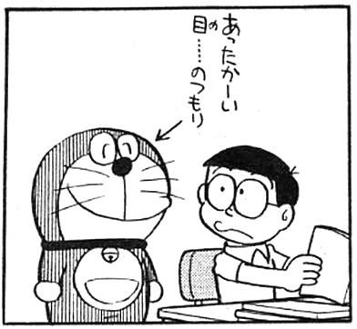

@snap[north-west]
"Listen to me" lightning talks party in Classmethod #1
@snapend

@snap[west]
# The hidden meaning of "@color[orange](Skyfall)"
@snapend

@snap[south]
@size[0.6em](© 2019 Classmethod, Inc.)
@snapend

@snap[south-east]
\#bond25
@snapend

Note:
- thanks you for your attention,
- i will start this presentation.

---?image=assets/img/profile_3a2p3s.png&position=right&size=35%
### Speaker

@snap[west]
**渡辺聖剛 (Watanabe, Seigo)**  

@ul[list](false)
- Operation Dept., AWS Business Unit
- Join: Janualy 2017
- Favorite AWS Service: Route 53
- #Infrastructure #Operation #Monitoring
- RareJob Lv: 4
@ulend
@snapend

Note:
- my name is seigo watanabe. watanabe is family name.
- as you know, in this company, i am called "seigo" from them.
- i joined this company at 2 years ago, and i belong to operation department.

---

### Target

@snap[west]
@ul[list](false)
- English newbies
- RareJob Lv: 2 or 3
@ulend

 
 
Please look at me 
with warmed eyes like this! ->
@snapend

@snap[south-east]

@snapend

Note:
- this lightening talk targeted to level 2 or 3.
- and i am afraid, the story may be bad know-how. be careful.

---

@snap[west]
## What is "Skyfall"
@snapend

Note:
- ok, I will talking about "Skyfall".
- This is my most favorite episode about "misleading" in the movie and the trailer itself.

---?image=assets/img/skyfall.jpg&position=bottom right&size=50%

### 007: Skyfall

@snap[west]
@ul[list](false)
- @color[orange](Oct. 2012)
- Spy movie, 23rd in the James Bond series
- Daniel Craig as James Bond, the MI6 agent
- Directed by	Sam Mendes
- Sony Pictures
- Teaser Trailer: @color[orange](May 2012)
@ulend
@snapend

Note:
- Has anyone seen this movie?
- ok, "Dubble-o-seven" is one of very famous action movie series.
- Skyfall is the one of it. starring daniel craig, releaseed by October 2012.
- and 5 month earlier, A teaser trailer was released.

---

@snap[west]
## May 2012
@snapend

Note:
- May 2012, i watched.

---?image=assets/img/interview.jpg&position=right bottom&size=50%

### A Scene in The Teaser Trailer

@ul[list](false)
- A man (interviewer) tell Bond, Bond answerd w/ short word:
  - "Country." "England."
  - "Gun." "Shot."
  - "Agent." "Provocateur."
  - "Murder." "Employment."
- and,
@ulend

Note:
- https://www.youtube.com/watch?v=0ESUAgMaOCY
- well, I want to introduce the sciene in the trailer.
- in somewhere, an interviewer tell Bond with short word, "Country."
- Bond answerd w/ short word too: "England."
  - "Gun." "Shot."
  - "Agent." "Provocateur."
  - "Murder." "Employment."

---?image=assets/img/interview_skyfall.jpg&position=right bottom&size=50%

### Teaser Trailer (cont.)

@ul[list](false)
- and,
  - "@color[orange](Skyfall)." "..."
  - (silence a while, with cuts of flashbacks)
- A interviewer repeat,
@ulend

Note:
- "Skyfall".
- No answer from Bond a while.
- And, A interviewer repeat,

---?image=assets/img/skyfall_done.jpg&size=contain

### Teaser Trailer (cont.)

@snap[midpoint]
@size[1.6em]("Skyfall.") 
Bond say simply: 
@size[2em]("Done.")
@snapend

@snap[south-east]
@size[0.6em](*https://www.youtube.com/watch?v=0ESUAgMaOCY*)
@snapend

Note:
- "Skyfall"
- at this time, Bond answered "Done."
- In Japanese trailer, the subtitle is "Finished."

---

@snap[midpoint]
@size[5em](😳)
@snapend

Note:
- Wow.
- This is an image of my face at that time.

---?image=assets/img/aco4_package.jpg&position=bottom left&size=12%

### "Skyfall" is WHAT??

@size[0.7em](("Done."... Japanese subtitle is "@color[orange](Finished)." ... What mean is it? ... Skyfall ... fall the sky. That feels have a huge scale... like "operation: Shuttered Skies"... It mean, I guess, Skyfall is something about a @color[orange](secret mission), operation, or code name itself assigned by the nation, a.k.a. MI6. However, James Bond looks strange somewhere... seems like lost his memory... Oh, dear? No... Ok, perhaps, 007 had completed the mission, but something happen with it. Because that accident, he lost memory with one or more critical things and was targeted by his own section, MI6... (imagination))

@snap[south-west]
@size[0.5em](　　　　　<- Shuttered Skies)
@snapend

@snap[south-east]
@size[3em](🤔)
@snapend

Note:
- I imagine about this situation and meaning.
- I guess, "Skyfall" is code name of a dangerous mission or operation he assigned. perhaps, 007 completed that mission, but he lost his own memory. This is key of the movie.

---

@snap[west]
## 7
@snapend

---

@snap[west]
## 7 MONTH
@snapend

---

@snap[west]
## 7 MONTH LATER
@snapend

---

@snap[west]
## 7 MONTH LATER (December 2012)
@snapend

Note:
- So, seven month later,

---

### 007: Skyfall Released

@snap[west]
@ul[list](false)
- London: 23 Oct. 2012
- Japan: 1 Dec. 2012
- Me: @color[orange](9 Dec.) 2012
@ulend
@snapend

Note:
- The movie was released. October in England, December in Japan.
- I went to a theater to see this. The story goes on, and the scene was shown.

---?image=assets/img/skyfall_real2.jpg&size=70%

### Real "Skyfall" is...

Note:
- Skyfall is...

---?image=assets/img/skyfall_real2.jpg&size=70%

### Real "Skyfall" is...

@snap[midpoint]
 
 
 
 
 
 
*過去のことだ*
@snapend

@snap[south-east]
@size[0.6em](\* Reproduction image *https://www.youtube.com/watch?v=24mTIE4D9JM*)
@snapend

---?image=assets/img/shocked.jpg&size=60%

Note:
- ????

---

### Real "Skyfall" is:

@ul[list](false)
- Subtitle is "@color[orange](The past)."
- Not an operation or a code name.
  - I don't write what it is for detail ;P
  - If you want to know the answer, watch this!
- "Finished." is just a @color[orange](misleading).
  - Not a @color[orange](trap).
  - Naturally occurring.
- The translator might not have any information.
  - Except the trailer itself
@ulend

@snap[south-east]
@size[0.6em](\* Note that the movie itself was very fun. Please do not misunderstand 😉)
@snapend

Note:
- Yes! That's misleading!
- perhaps, it is Not a trap, but naturally occurring misleading.
- I think: when the trailer translating, The translator did not have any information about the story except the trailer.

---

### TIL (Today I Learned):

@ul[list](false)
To avoid misleading, @color[orange]("Context") is very important.  
@ulend
  
@quote[context = the **situation**, events, or **information** that are related to something and that **help you to understand it**](Longman Dictionary)
  
@ul[list](false)
- Share context first, and be able to use a @color[orange](simple word).
@ulend

Note:
- TIL is that:
- To avoid misleading, "Context" is very important.
- but, with reverse thinking, you can use just simple answer with already shared situaton.

---

### To explain the situation

@ul[list](false)
- Split between "Share context" and "Tell what you want to".
  - Unix philosophy: *Make each program @color[orange](do one thing) well.*
- **At this level**, Priority of Grammer is @color[orange](low)
  - but, It is important to understand English!
- DO NOT HESITATE TO USE SIMPLE WORDS!
@ulend

Note:
- Let's split between "Share context" and "Tell what you want to", as known as, "describe" and "desier".
- as you know, unix philosophy said that: Make each program do one thing well.
- english is the same. each sentence do one thing well.

---

@snap[west]
## APPENDIX:
@snapend

Note:
- ok, my story was done.
- this is appendix, as for your information,

---?image=assets/img/bond25.png&position=right&size=35%

### Bond 25

@snap[west]
@ul[list](false)
- an upcoming spy film in the James Bond series
- Release 2020 (TBD)
- https://www.007.com/ \#bond25
- @color[orange](STAY TUNED!)
@ulend
@snapend

Note:
- New movie will come for the next year.
- Named "Bond twenty-five"

---

@snap[midpoint]

@snapend

Note:
- My speech is over.
- Thanks you for your lestening.
