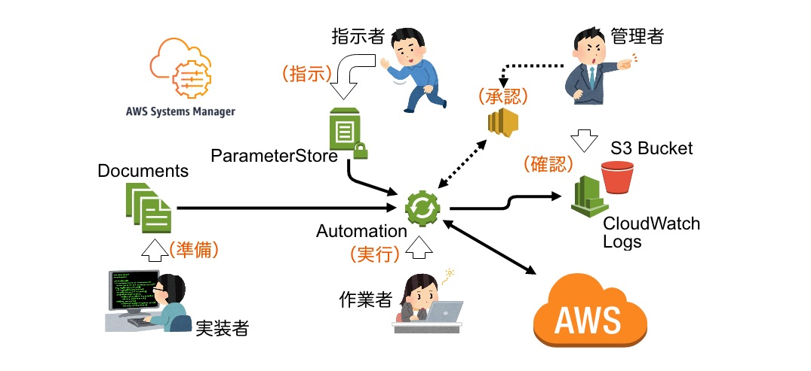
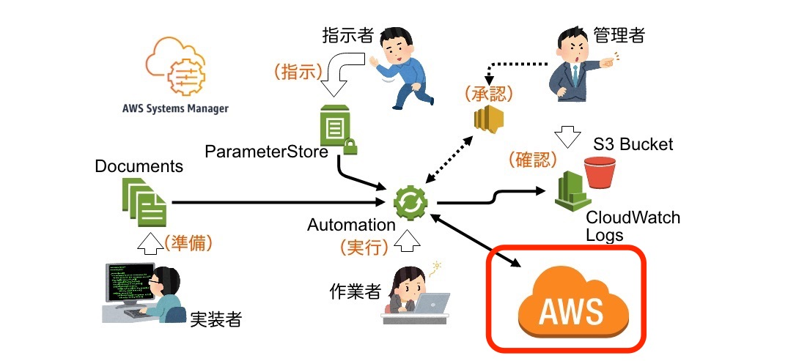

---?image=assets/img/akiba-aws-02.png&size=100%

---
@color[orange](AKIBA.AWS #10)

# AWS Systems Manager 最近の UPDATE で 出来るようになったこと

---?image=assets/img/profile.png&position=right&size=35%

## 自己紹介

### 渡辺聖剛 Seigo Watanabe

@ol[list-square](false)
- '17/01入社
- AWS事業本部 オペレーション部所属
- CM入社前はインフラエンジニア(オンプレ)
- 好きなサービス : @color[orange](AWS Systems Manager)
@olend

---

## 最近のアップデート

---

### 2018 年の関連アップデート

|  日付  |                                                             内容                                                              |
| :----: | :---------------------------------------------------------------------------------------------------------------------------- |
| Feb  6 | AWS Systems Manager、カスタムの構成可能なリポジトリ、Linux アプリケーションパッチ適用、SUSE Linux 用のパッチサポートを追加    |
| Mar  7 | AWS Systems Manager に InSpec by Chef のサポートを追加                                                                        |
| Mar 29 | AWS Systems Manager が、CentOS Linux でのパッチ管理を追加                                                                     |
| Mar 29 | AWS Config の通知が、Amazon CloudWatch Events と統合されます                                                                  |
| Apr 30 | Amazon Inspector には、繰り返し評価ランをスケジュールする機能と、コンソールからエージェントをインストールする機能が追加される |
| May  9 | Amazon ECS は、AWS CloudFormation を使用して、ECS-Optimized EC2 インスタンスの開始のための SSM パラメーターを追加します       |
| May 15 | AWS Systems Manager はクリック 1 つですべてのマネージドインスタンスにあるインベントリを収集可能                               |
| Jul 10 | AWS Systems Manager エージェントは現在、Ubuntu 16.04 LTS および 18.04 LTS AMI にプリインストールされています。                |
| Jul 18 | @color[orange](AWS Systems Manager Automation のステップ失敗時の条件分岐 )                                                    |
| Jul 18 | @color[orange](AWS Systems Manager Run Command が Amazon CloudWatch Logs にストリーム出力されるようになりました)              |
| Jul 26 | AWS Systems Manager パラメータストア は AWS Secrets Manager と統合、ラベリングを追加し設定の更新を容易に                      |
| Aug  9 | AWS Systems Manager はオートメーションの実行にタグとターゲットマップを追加します                                              |
| Aug  9 | AWS Config で AWS Systems Manager のパッチコンプライアンスと関連付けのコンプライアンスのサポートを追加                        |
| Aug 16 | AWS CloudFormation は CloudFormation テンプレートで AWS Systems Manager 安全文字列パラメータをサポート                        |
| Aug 16 | AWS Systems Manager にインサイトと 1 クリックでの修正機能が追加され、インベントリ収集を簡単に管理                             |
| Aug 28 | @color[orange](AWS Systems Manager Automation が AWS API 呼び出しのサポートを開始)                                            |
| Sep 11 | @color[orange](AWS Systems Manager Session Manager のご紹介)                                                                  |
| Sep 26 | @color[orange](条件付分岐が AWS Systems Manager Automation でサポートされるように)                                            |
| Oct  1 | AWS Systems Manager Announces Enhanced Compliance Dashboard                                                                   |

---

### @color[orange](≫) AWS API 呼び出しのサポート開始
### @color[orange](≫) Automation で条件付分岐サポート

@ol[list-square](false)
- YAML を書けば AWS API を@color[orange](たたける)ようになった
    - AWS CLI で出来ることはほぼ出来る！
    - メンテナンスウィンドウ指定しての時間実行も可能
- ランブック（Document）内で@color[orange](複合的な処理)が書けるように
    - 対象をグループ分けする必要がなくなる
    - OS、インスタンスタイプ、タグ(ProdとDev)　etc.
    - 条件分岐のための値はランブック内で取得
@olend

---

### @color[orange](≫) Session Manager

@ol[list-square](false)
- みんな大好き
- 省略
@olend

---

## 復習：もともと得意なこと

---

### @color[orange](1.) 管理者・指示者・作業者・実装者の分離

@ol[list-square](false)
- 管理者 ... 実行の承認を行う
- 指示者 ... 作業対象や内容を指示する
- 作業者 ... 作業の実行・一次確認を行う
- 実装者 ... 作業内容をロジックに落とし込む
@olend

---

### @color[orange](2.) 準備・指示・実行・確認の分離

@ol[list-square](false)
- 準備 ... 事前にランブック（Document）を作成しておく
- 指示 ... 作業前に対象を指定する（パラメータストア等）
- 実行 ... クリック or 時間実行（メンテウィンドウ）
    - 承認 ... 実行時に承認を行う（SNS通知）
- 確認 ... 実行証跡が全て AWS 上に残る
@olend

---

#### 図にするとこう

---

## 出来るようになったことの具体例

---

### こんなことが出来るように（ユースケース）

@ol[list-square](false)
- 一時的に権限付与・作業を許可（事前承認、時間制限つき）
    - @color[orange](OS ログインを許可)
    - Route 53 のゾーン編集
- @color[orange](ELB から一時的に外しつつ) EC2 インスタンスタイプ変更
- @color[orange](AutoScailing から一時的に外しつつ) EC2 停止 / 起動
- @color[orange](RDS) の任意タイミングでのスナップショット取得
- ディストリビューションを@color[orange](限定して) CloudFront Invalidation
- 前段処理の結果を受けての@color[orange](分岐処理 / エラー処理)
@olend

---

### こんなことが出来るように（cont.）

@ol[list-square](false)
- 得意なことは変わらない
- 出来ること = ユースケースが広がった
@olend

---

#### 具体的にはこのへん

---

### 適応しそうなところ

@ol[list-square](false)
- @color[orange](権限を限定)した AWS インフラのマニュアル作業
    - 完全自動化するなら Lambda やら StepFunctions やら
- @color[orange](定形化)された作業、@color[orange](証跡)が必要な作業
- 似たような作業を延々手でやるのが嫌なとき
    - ASG 用の AMI アップデート作業とか
    - リリース前に決まったインスタンスの手動バックアップとか
    - CloudFront Invalidation とか（コンテンツ担当に@color[orange](任せたい)！）
@olend

---

### 多少めんどいところ

@ol[list-square](false)
- ドキュメントが少ない（その割に出来ることが多い）
- SSM Agent の導入が必須
    - 正確には EC2 を「マネージドインスタンス」にする
    - （実は Automation だけなら必須ではない）
    - 新しめの AMI には最初から導入済み（IAM ロールは必要）
    - 古い AMI から起動して使い続けてるインスタンスだと…
- 過度な自動化・仕組み化は逆の@color[orange](つらみ)がある
@olend

---

## まとめ

---

### まとめ

@ol[list-square](false)
- AWS Systems Manager は業務と権限を@color[orange](適切に分離)できます
- ここ最近の UPDATE で、その適用範囲がぐんと@color[orange](広)がりました
- 時間実行したくなったときのために
    - EC2 インスタンス建てるときは SSM Agent 忘れずに！
    - IAM ロールもね！
- お好みで CloudWatch Agent も！
- 適材適所を@color[orange](見極めて)快適な運用を！
@olend

---

@snap[midpoint]

@snapend