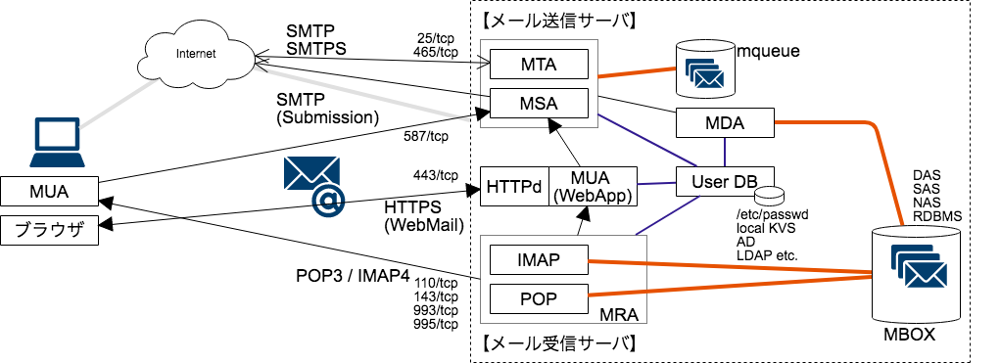

---

第7回このサービスは俺に聞け勉強会  
@color[Gray](@size[0.6em](というか聞いて下さいお願いします))

# SMTP篇

---

### Goal

* MTAとMSA（とMDAと以下略）の違いを知ってもらう
* メールシステムが簡単に組めなくなった理由を知ってもらう
    * 歴史（プッシュ型メッセージの光と影）
    * 技術（いかにして相手を信頼するか・させるか）
* ~~「やっぱりSMTPは滅ぶべき」という認識を持ってもらう~~
* SMTPは簡単には滅ばないので頑張る覚悟を持ってもらう

---

### Agenda

- 「メールサーバ」is 何
    - MTA / MDA / MSA / MUA / MRA
- 実演 SMTP
- 迷惑メールとの戦い インフラ編
    - 逆引き / SPF / DBL / OP25B ...

---

## 「メールサーバ」 is 何

---

### 「メールサーバ」のイメージ


<!--
メールサーバ
-->
<!--
メール送信サーバ(SMTPサーバ)
メール受信サーバ(POP・IMAPサーバ)
メール中継サーバ(MX)
メールストア(MBOX)サーバ
メール配信サーバ(メルマガ・大量配信)
リストサーバ（メーリングリスト）
その他特定用途向け
プロキシ(delegate)サーバ
Webメール（Gmailなど）
メールエージェント
    MTA (Mail Transfer Agent)
    MDA (Mail Delivery Agent)
    MSA (Mail Submission Agent)
    MUA (Mail User Agent)
    MRA (Mail Retrieval Agent)
-->

<!--
メールプロトコル
-->
<!--
SMTP / SMTPS
LMTP
POP(POP3) / POPS
IMAP(IMAP4) /IMAPS
-->

<!--
メール用のポート番号
-->
<!--
25/tcp (smtp)
465/tcp (smtps)
587/tcp (smtp submission)
110/tcp (ppo3)
995/tcp (pop3s)
143/tcp (imap4)
993/tcp (imap4s)
-->

<!--
その他なんとなく関係しそうなもの
-->
<!--
MX
SPF
DKIM
-->

---

### よく描かれる「メールサーバ」の図


<!--
メールサーバ1台にストレージ
-->

---

### 細かく描くとこう



<!--
送信と受信とストア
-->

※状況に応じてMXやメール配信・Virus Checkなど

Note:

- 少なくとも送信サーバと受信サーバは分けて考えないと、プロトコルから違うので混乱する

---

### ここまでのまとめ

- 「メールサーバ」には沢山の機能がある
- 機能ごとに Stateful / Stateless が異なる
- @color[orange](認証と MBOX が共通に出来れば)機能分離も楽
- 機能分離すればシンプルにできる
    - 負荷分散設計もしやすい

Note:

- 目標 5分

---

## 手でメールを送ってみよう

---

### 準備

* Amazon Linux で EC2 インスタンス起動
    * tX.nano で良いです
    * AL2 の場合は `nc` を手動でインストールしてください
* ログインできるようにしておいてください
    * SSH でも Session Manager でも ok

---

### デモ

```
$ nc localhost 25
```

---

```HTTP
220 ip-172-31-30-189.ap-northeast-1.compute.internal ESMTP Sendmail 8.14.4/8.14.4; Mon, 8 Oct 2018 05:19:56 GMT
HELO localhost
250 ip-172-31-30-189.ap-northeast-1.compute.internal Hello localhost [127.0.0.1], pleased to meet you
MAIL FROM: root@localhost
250 2.1.0 root@localhost... Sender ok
RCPT TO: ec2-user@localhost
250 2.1.5 ec2-user@localhost... Recipient ok
DATA
354 Enter mail, end with "." on a line by itself
```
(続く)

---

(続き)

```HTTP
From: <root>
To: <ec2-user>
Subject: Test mail from localhost

Testmail body.
.
250 2.0.0 w985Juj0012561 Message accepted for delivery
QUIT
221 2.0.0 ip-172-31-30-189.ap-northeast-1.compute.internal closing connection
```

---

### このとき、SMTPサーバは

|            入力             |             説明              |                                   SMTPサーバ側の処理                                    |
| :-------------------------- | :---------------------------- | :-------------------------------------------------------------------------------------- |
| nc localhost 25             | (接続コマンド)                | どんなIPアドレスから繋いできたか、<br/>逆引きはあるか、<br/>ブラックリスト、Graylisting |
| HELO localhost              | 送信元のホスト名を<br/>名乗る | 名乗ったホスト名はDNSと<br/>整合しているか、SMTP-AUTHを<br/>求めているか                |
| MAIL FROM: root@localhost   | 接続元                        | 送信元とホスト名との整合性、<br/>SPF                                                    |
| RCPT TO: ec2-user@localhost | 送信先                        | 送信先は受信(処理)すべき<br/>ものか                                                     |
| DATA                        | これ以降は<br/>メール本文     | MTAが見るのはここまで<br/>（本文は見ない）                                              |

---

### このとき、SMTPサーバは (cont.)

|          入力           |                         説明                         |        SMTPサーバ側の処理         |
| :---------------------- | :--------------------------------------------------- | :-------------------------------- |
| From: &lt;root>         | メールヘッダ上のFrom<br/>送信元(Envelope From)とは別 |                                   |
| To: &lt;ec2-user>       | メールヘッダ上のTo<br/>送信先(Envelope To)とは別     |                                   |
| Subject: Test mail .... | メールヘッダ                                         | サブジェクトはMTAのログに残らない |
| .                       | . だけの行があると本文は終了                         |                                   |

---

### ポイント

- From: と Sender (Envelope From) は違う
- To: と Recipient (Envelope To) は違う
- 転送メールや BCC: のためには必須の仕様
- そこを@color[red](悪用)して詐称メールが送られる

Note:

- 目標 25分

---?image=assets/img/SPAM_20.png&size=contain

## 迷惑メールとの戦い インフラ編

---

### 迷惑メール #とは

- 受け側が「迷惑」と思ったメール
    - いわば「@color[orange](マナー違反)メール」
- 内容が迷惑 = 送り届けた後に受信者が判断
    - 対策 : ベイズフィルタ、Anti-Virus、AI
    - PRメール（未承諾広告※）などはオプトアウト可能
- 送り方が迷惑 = DoS/DDoS = @color[orange](インフラが全力で止める)
    - 大量送信、大量コネクション、プロトコル軽視、エラー無視

---

### 送り方的迷惑メールは「受け取らない」

- 「受け取らない」=「コネクション切断」
- なぜなら、受け取った後エラーで返しても無駄だから
    - そもそも返す先が偽装や踏み台かも = 返せない！
    - エラーメールを返すコストが莫大
    - 不要なストレージ消費（MBOX/mqueue）
- 「何故受け取らなかったか」も@color[orange](伝えない)
    - 次はそこを対策してくる

Note:

- 2000年当時のISPや携帯キャリアはこれで苦労した

---

### 迷惑メールを@color[orange](受け取らない)

|                                説明                                 |          具体的な実装例          |
| ------------------------------------------------------------------- | -------------------------------- |
| IP アドレスのレピュテーション<br/>過去にspamを送っていないか        | DBL (DNSBL), Spamhaus, Blacklist |
| DNS正引き・逆引きに齟齬はないか                                     | PTR RR                           |
| 25/tcp通信が許可される範囲の限定                                    | IP25B (内部向けの場合)           |
| `HELO` で名乗ったホスト名は適切か、<br/>DNS逆引きと齟齬が無いか     |                                  |
| SMTP/ESMTPプロトコルに適切に従っているか                            | ならず者はDropする               |
| 無条件に接続を切ってみて相手は再送してくるか                        | Graylisting                      |
| 届いたメールが正規のサーバから送信されたか<br/>改ざんされていないか | Sender ID, DKIM, SPF             |

---

### 「迷惑メール」を@color[orange](送らない)ために

自サーバの信頼を下げないために

|                      説明                       |              具体的な実装例              |
| ----------------------------------------------- | ---------------------------------------- |
| 適切なDNS設定                                   | PTR RR                                   |
| メール送信時には認証認可を行う                  | SMTP-AUTH (587/tcp)、~~POP before SMTP~~ |
| `HELO` で適切に名乗る（NAT越し、分散、Act/Std） | Postfix `smtp_helo_name`                 |
| 必要なメールは適切に再送する(Graylistnig対策)   |                                          |
| エラーメール率を低く抑える                      | エラー送信先のリスト除外                 |
| 無理矢理送らない                                | IPアドレスあたりのコネクション数　等     |
| デコイメアドにメールを送らない(一部のDBL対策)   | 送信先の認証                             |

Note:
- デコイメアド(造語) - メアド名簿として公開されているリストに潜ませてある
- メルマガの宛先リストはちゃんとメンテしましょう

---

### 余録 : spam業者に利用されないために

|                    説明                    |      具体的な実装例      |
| ------------------------------------------ | ------------------------ |
| 自IPレンジ内に野良SMTPサーバを建てさせない | OP25B                    |
| オープンリレーにならないようにする         | Postfix `relayhost` 他   |
| そもそも侵入されない                       | 侵入対策・マルウェア対策 |

---

### 例 : NAT越しのメール送信の図


Note:

- A と MX は別もの
- SPF は送信するときに関係
- 送り先が見えるIPアドレスについて設定
    - 逆引きも
    - smtp_helo_name も

---

### なぜこんなものが必要？

- 「メッセージ」単位で送信元・送信先が処理を行う
    - 中央集権的なコントローラが@color[orange](ない)
- 複雑な「メール」の機能
    - 転送メール = 中継されるとその先はもとのことが@color[orange](分からない)
    - メールヘッダには情報が追記されていく = 改ざん防止ができない
- 大量のメッセージ処理をテキストベースで行う必要
- メールをフィルタリングすることの@color[orange](プライバシー)問題
    - HTTP と違い、ほぼ全てが「@color[orange](私信)」と判断される
    - プッシュ型の通信なので、プル型と比べて問題が多い
        - peer-to-peer 通信時に送信者がいないことがある
    - @color[orange](まず受信)して、それから処理する必要

Note:

#### ちなみに : 2010 年の記事

> 全メールに占める迷惑メールの割合は、2000 年時点では 8 ％に満たない程度だったが、2009 年にはおよそ 90 ％  
> 2009 年中に送信された迷惑メールは、40 兆通に達する

- [全メールの9割が迷惑メールに、流通量は1年で40兆通 | 日経 xTECH（クロステック）](https://tech.nikkeibp.co.jp/it/pc/article/news/20100114/1022157/)
- 40兆/365 ≒ 1,000億強/日
    - 2018 年は 2,800億強/日

---

## まとめ

---

### 話したことのまとめ

- 自前でメール配信サーバを運用するのは大変
    - 送りたい量が多ければ特に大変
    - 極力マネージドサービス使う（SES、SendGrid）
    - 配信業者は送信者のリストの運用に注力しよう
- 内部利用でもメール以外の方法を考えたほうが楽
    - Slack、Backlog
- とはいえ、メールのほうが楽なことも
    - 再送機構、UI など

---

@snap[midpoint]

@snapend